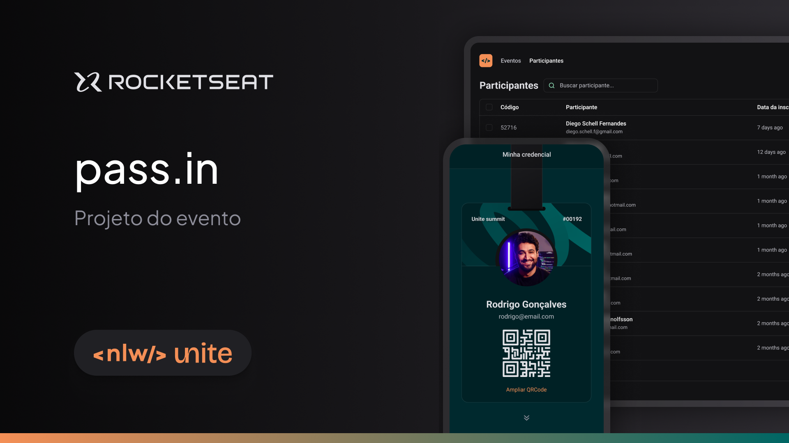

<h1 align="center">
  
</h1>

### Sobre o projeto

O pass.in é uma aplicação de gestão de participantes em eventos presenciais. A ferramenta permite que o organizador cadastre um evento e abra uma página pública de inscrição. Os participantes inscritos podem emitir uma credencial para check-in no dia do evento. O sistema fará um scan da credencial do participante para permitir a entrada no evento.

## :rocket: Tecnologias

Esse projeto foi desenvolvido com as seguintes tecnologias:

- [React](https://pt-br.reactjs.org/)
- [React Native](https://reactnative.dev/)
- [Nativewind](https://www.nativewind.dev/v4/getting-started/expo-router)
- [TypeScript](https://www.nativewind.dev/v4/getting-started/typescript)
- [Tailwind CSS](https://tailwindcss.com/)
- [JSON Server]()
- [TanStack React Query]()
- [React Hook Form]()
- [ZOD]()
- [HookForm/Resolvers]()

## :computer: Projeto

Projeto construído no evento NLW Unite na Trilha React Native onde foi desenvolvido uma aplicação de gestão de participantes em eventos presenciais (pass.in)

## :label: Layout

Você pode visualizar o layout do projeto através [desse link](https://www.figma.com/community/file/1356738933008624188/unite-summit). É necessário ter conta no [Figma](https://figma.com) para acessá-lo.

## :notebook: Sumário
- [Tecnologias](#rocket-tecnologias)
- [Projeto](#computer-projeto)
- [Layout](#label-layout)
- [Créditos](#tada-créditos)

## :tada: Créditos

A ideia do app faz parte da [Rocketseat](https://www.rocketseat.com.br/) dentro de um evento chamado NLW Unite na trilha React Native.
